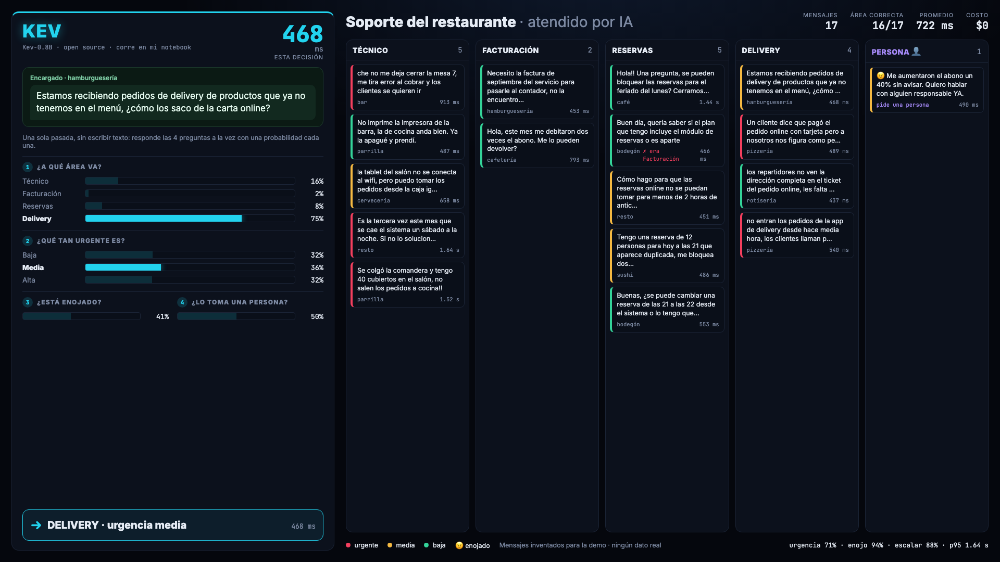

# Soporte de restaurante atendido por Kev

Una bandeja de soporte para restaurantes que atiende una IA **corriendo en una notebook**, sin nube y sin costo por uso. Van entrando mensajes de dueños, encargados, mozos y cajeros, y para cada uno el modelo decide en menos de un segundo:

1. **¿A qué área va?** Técnico, Facturación, Reservas o Delivery.
2. **¿Qué tan urgente es?** Baja, media o alta.
3. **¿Está enojado?**
4. **¿Lo tiene que tomar una persona?** Pide un reembolso, amenaza con darse de baja o denunciar, pide un responsable, tiene un problema repetido o el mensaje es demasiado vago.

Si pide una persona, o si el modelo no está seguro del área, el mensaje va a la columna **Persona 👤**: en vez de adivinar, se lo pasa a alguien.



A la izquierda se ve el mensaje que entra, las cuatro respuestas con su probabilidad y cuánto tardó en decidir. A la derecha, el tablero con cada mensaje en su columna, coloreado según urgencia (😠 = enojado).

> **Los mensajes son inventados** (`data/mensajes.jsonl`). No hay datos reales de clientes, restaurantes ni marcas.

## De dónde sale Kev

El modelo es **Kev**, de [**github.com/jaredpalmer/kev**](https://github.com/jaredpalmer/kev) (Apache 2.0, de Jared Palmer). Es una familia de modelos de decisión open source construidos sobre Qwen3.5, inspirados en Jev, el modelo de decisión cerrado de TypeSafe. Habla la misma API (`POST /v1/systemone`).

Lo que lo hace distinto de un chatbot: **Kev no escribe texto**. Le pasás un texto y una o varias preguntas tipadas (`choice` para opción múltiple, `noul` para sí/no, `score` para una escala) y en **una sola pasada** devuelve una probabilidad calibrada para cada respuesta. No hay que esperar a que genere una respuesta ni parsearla.

Acá usamos el más chico, [**Kev-0.8B**](https://huggingface.co/jaredpalmer/kev-0.8b), que corre en cualquier Mac con Apple Silicon (MLX) o en una GPU de 4 GB.

## Cómo funciona

Una sola llamada a Kev por mensaje, con las cuatro preguntas juntas (`soporte/kev.py`):

```jsonc
{
  "state": { "from": "Encargado · parrilla", "message": "Se colgó la comandera y tengo 40 cubiertos..." },
  "questions": {
    "area":     { "type": "choice", "criteria": { "tecnico": "...", "facturacion": "...", "reservas": "...", "delivery": "..." } },
    "urgencia": { "type": "score",  "criteria": ["Low: ...", "Medium: ...", "High: ..."] },
    "enojado":  { "type": "noul",   "instructions": "Is the sender angry or upset?" },
    "escalar":  { "type": "noul",   "instructions": "Should a human take over (...)?" }
  }
}
```

Algunas decisiones que tomamos midiendo:
- **Mensajes en español, preguntas en inglés.** Kev se entrenó en inglés. Con las preguntas en inglés la urgencia exacta sale 67 %; en español, 50 %. El área rinde parecido en los dos.
- **Descripciones claras de cada área.** Al aclarar que todo lo de pedidos online va a Delivery (aunque "no entren" o "fallen"), el acierto de área pasó de 85 % a 92 %.
- **Umbrales:** "enojado" y "persona" se activan con probabilidad ≥ 0,6.
- **Cuando duda, no adivina:** si la confianza en el área es menor a 0,45, el mensaje va a una persona.

## Resultados

Medido con `scripts/evaluar.py` contra la respuesta correcta de cada uno de los 60 mensajes:

| Pregunta | Acierto |
|---|---|
| Área | **92 %** |
| Urgencia exacta / con margen de un nivel | 67 % / 98 % |
| ¿Está enojado? | 92 % |
| ¿Lo toma una persona? | 83 % |
| Área cuando Kev está seguro (confianza ≥ 0,5, el 85 % de los mensajes) | **96 %** |

**Tiempo:** ~0,4-0,7 s por mensaje en un MacBook M1 Pro de 16 GB (sube si la máquina está corta de memoria). **Costo:** $0.

**Límites, para ser honestos:**
- Las descripciones de las áreas y los umbrales se ajustaron mirando estos mismos 60 mensajes, así que con mensajes nuevos puede rendir algo menos.
- 60 mensajes alcanzan para una demo, no para un benchmark.
- Es el Kev más chico. Los más grandes (4B, 9B, 27B) aciertan más pero piden más memoria. Kev también permite fine-tuning con mensajes propios.

## Correrlo

Necesitás Python 3.12 o 3.13 y [uv](https://docs.astral.sh/uv/).

```bash
git clone https://github.com/cardo991/kev-soporte-resto.git && cd kev-soporte-resto

# 1. Kev (una sola vez): clonarlo e instalar su server
git clone --depth 1 https://github.com/jaredpalmer/kev.git vendor/kev
(cd vendor/kev && uv sync --extra serve)

# 2. Esta app
uv sync

# 3. Levantar todo: Kev en :8009 (la primera vez baja el modelo) y la bandeja en :8002
./scripts/start.sh
open http://127.0.0.1:8002
```

Tocá **▶ Abrir la bandeja** y empiezan a entrar los mensajes de ejemplo. Cada sesión queda guardada en `replays/` y se puede volver a reproducir.

### Con tus propios mensajes

- **Tipearlos:** abajo del tablero hay un campo para escribir un mensaje (y quién lo manda). Apretá Enter y Kev lo clasifica como a cualquier otro.
- **Importar un chat de WhatsApp:** en el celular, abrí el chat → menú → *Más* → *Exportar chat* → *Sin archivos*, y pasá el `.txt` (o el `.zip`) a la compu. En la app tocá **📎 Importar chat de WhatsApp** y los mensajes entran uno por uno (`soporte/whatsapp.py`, formatos de Android y de iPhone).
  - Los nombres se reemplazan por "Contacto 1", "Contacto 2"…; se saltean los mensajes del sistema y los multimedia.
  - Todo se procesa en tu máquina: el chat no sale a internet. Las sesiones quedan en `replays/`, que no se sube al repo. Ojo con publicar videos de chats reales.
  - Estos mensajes no tienen respuesta correcta, así que no suman al marcador de aciertos.

Conectarlo a WhatsApp en vivo requiere la API oficial de WhatsApp Business (cuenta de empresa verificada, número dedicado y un webhook con URL pública). Las librerías no oficiales que se conectan como si fueran WhatsApp Web violan los términos de WhatsApp y pueden hacer que te bloqueen el número.

Otros comandos:

```bash
uv run python scripts/evaluar.py              # mide a Kev contra las respuestas correctas
uv run python scripts/evaluar.py --lang es    # lo mismo, con las preguntas en español

uv sync --extra record && uv run playwright install chromium
uv run --extra record python scripts/record.py --speed 1   # graba la última sesión en video (1920×1080; MP4 si hay ffmpeg)
```

## Estructura

```
data/mensajes.jsonl   60 mensajes inventados con su respuesta correcta
soporte/kev.py        cliente de Kev: arma las 4 preguntas y lee las probabilidades
soporte/server.py     FastAPI + WebSocket: hace entrar los mensajes, consulta a Kev y guarda la sesión
soporte/whatsapp.py   lee un chat exportado de WhatsApp (.txt/.zip) y anonimiza los nombres
web/                  la pantalla (decisión a la izquierda, tablero a la derecha)
scripts/start.sh      levanta Kev y la bandeja
scripts/evaluar.py    mide aciertos
scripts/record.py     graba una sesión como video
tests/                tests del lector de WhatsApp (uv run --with pytest pytest -q)
```

## Créditos

- [Kev](https://github.com/jaredpalmer/kev), de Jared Palmer (Apache 2.0). Este repo no incluye el código ni los pesos de Kev: se descargan de su repo y de [Hugging Face](https://huggingface.co/jaredpalmer/kev-0.8b).
